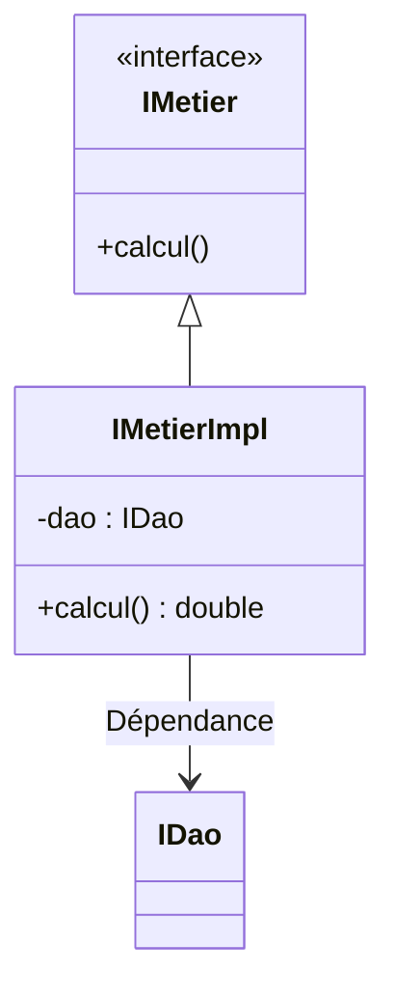
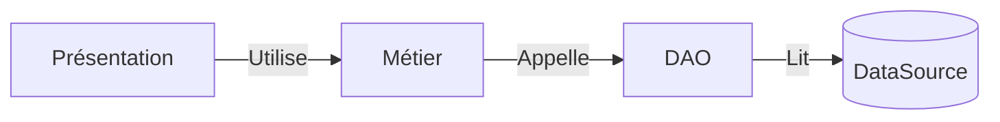

# Spring - Injection de Dépendances

Ce TP avait pour objectif de **maîtriser l'injection de dépendances** avec Spring à travers 4 approches différentes :

### 🔧 Méthodes d'injection étudiées

1. ⚙️ **Injection manuelle**  
   - Configuration explicite dans le code
   - Approche bas niveau

2. 🌀 **Injection dynamique**  
   - Résolution à l'exécution
   - Flexibilité accrue

3. 🏷️ **Par annotations**  
   - `@Autowired`, `@Component`, etc.
   - Approche déclarative

4. 📄 **Via XML**  
   - Configuration externe
   - Séparation claire code/config

### Compétences visées
- ✅ Comprendre le principe d'IoC (Inversion of Control)
- ✅ Comparer les différentes approches DI (Dependency Injection)
- ✅ Choisir la méthode adaptée au contexte
- ✅ Configurer un contexte Spring efficacement

L'application simule un calcul métier basé sur des données fournies par un DAO.

## Structure du Projet


### 🔹 Couche DAO
**Composants implémentés** :
- Interface `IDao`  
  ```java
  public interface IDao {
      double getData();
  }
- Deux implémentations :
  - `DaoImpl` (simule une base de données)
    
  

  - `DaoImplV2` (simule la version Web Service)
    
  

  - `DaoImplVCapteur` (simule les capteurs)
    
  
  

Chaque implémentation retourne une valeur différente pour démontrer l'injection dynamique.

### 🔹 Couche Métier

Méthodes d'injection testées :
- 🏗️ Par constructeur (recommandé)
- 🔧 Par setter
- 🏷️ Par annotation `@Autowired`

### 🔹 Couche Présentation
4 méthodes d'injection ont été testées :

| #   | Méthode                          | Technologie                          | Avantages                                      | Inconvénients                             |
|-----|----------------------------------|--------------------------------------|-----------------------------------------------|-------------------------------------------|
| 1️⃣ | **Injection manuelle (Pres1)**   | Instanciation directe sans Spring    | • Simple à comprendre                        | • Crée un couplage fort                   |
|     |                                  |                                      |                                               | • Peu flexible                            |
| 2️⃣ | **Injection dynamique (Pres2)**  | Reflection Java + config.txt         | • Modifiable sans recompilation               | • Risques d'erreurs à l'exécution         |
|     |                                  |                                      | • Comportement ajustable à chaud              | • Configuration externe nécessaire        |
| 3️⃣ | **Spring par Annotations**       | `@Repository`, `@Service`, `@Component` | • Configuration minimale                   | • Moins visible sans IDE                  |
|     | **(PresSpringAnnotation)**       |                                      | • Grande flexibilité                         | • Moins explicite                         |
| 4️⃣ | **Spring par XML**               | Fichier config.xml                   | • Configuration centralisée                  | • Syntaxe verbeuse                        |
|     | **(PresSpringXML)**              |                                      | • Modifiable sans recompiler                 | • Moins intuitive que les annotations    |

### 1. Injection Manuelle 
### 2. Injection Dynamique
### 3. Spring par Annotations
### 4. Spring par XML

---- config.xml:


## Flux Global


## 📝 Observations Clés
- **Spring optimise considérablement** la gestion des dépendances
- **L'injection par constructeur** garantit l'initialisation des dépendances obligatoires (approche la plus robuste)
- **La configuration XML** permet une gestion centralisée au détriment de la concision
- **Les annotations** simplifient la configuration mais réduisent la visibilité globale
- **Le couplage faible** inhérent à Spring améliore la maintenabilité et la testabilité (pour une application fermée à la modification et ouverte à l'extension)
- **Le contexte d'application** unifié facilite la gestion du cycle de vie des composants

## 🔍 Analyse Comparative

| Approche           | Avantages                          | Inconvénients                     |
|--------------------|------------------------------------|-----------------------------------|
| Injection manuelle | Idéale pour les prototypes grâce à sa simplicité | Crée un couplage fort et manque de flexibilité |
| Injection dynamique | Permet des ajustements sans nécessiter de recompilation | Augmente les risques d'erreurs lors de l'exécution |
| Annotations Spring | Offre un bon compromis entre simplicité et maintenabilité | La configuration est moins visible sans outil IDE |
| Configuration XML  | Permet une modification externe facile de la configuration | Syntaxe verbeuse et moins intuitive à utiliser |

## ✅ Acquis d'apprentissage

### 1. Maîtrise des concepts fondamentaux
- Différenciation claire entre **couplage fort** et **couplage faible**
- Compréhension du principe d'**Inversion de Contrôle** (IoC)
- Assimilation du pattern **Dependency Injection**

### 2. Mise en pratique technique
- Implémentation manuelle de l'IoC **sans Spring** :
  - Par constructeur
  - Par setters
  - Par interface
- Configuration de Spring avec :
  - **Fichiers XML** (déclaration explicite des beans)
  - **Annotations** (`@Component`, `@Autowired`, etc.)

### 3. Critères de sélection
- Capacité à choisir le type d'injection approprié :
  - **Constructeur** : pour les dépendances obligatoires
  - **Setter** : pour les dépendances optionnelles
  - **Champ** : pour les cas simples (avec prudence)
- Évaluation des avantages/inconvénients de chaque approche

### 4. Bonnes pratiques assimilées
- Utilisation des interfaces pour réduire le couplage
- Documentation des dépendances
- Tests d'injection avec différents profils

## 🔧 Technologies Utilisées
<p align="left">
  <a href="https://www.java.com" target="_blank" rel="noreferrer">
    
  </a>
  <a href="https://spring.io" target="_blank" rel="noreferrer">
    
  </a>
  <a href="https://maven.apache.org" target="_blank" rel="noreferrer">
    
  </a>
  <a href="https://www.jetbrains.com/idea/" target="_blank" rel="noreferrer">
    
  </a>
</p>

## Conclusion
Ce travail m'a permis d'acquérir une base approfondie des différents mécanismes d'injection de dépendances dans Spring, combinant efficacement annotations et XML pour une gestion modulaire et adaptable.

**Auteur :** 💻 Safae ERAJI
